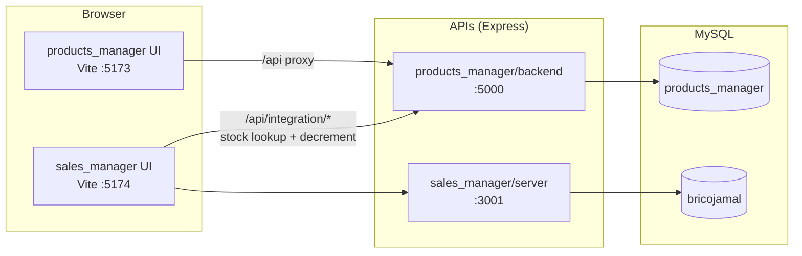

# SOHOFI BRICO

Bilingual (French / Arabic) inventory and sales management suite for Moroccan hardware stores,
drugstores and DIY shops (*quincaillerie / droguerie*).


---

## Overview

This repository is a monorepo containing two independent but connected applications that
share a product catalogue:

| Application | Purpose | Frontend | Backend API | Database |
| --- | --- | --- | --- | --- |
| [`products_manager`](./products_manager) | Product catalogue, stock levels, price history, QR codes, Excel export | React 18 + TypeScript + Vite | Express on **port 5000** | `products_manager` |
| [`sales_manager`](./sales_manager) | Sales entry, customers, credit tracking, wishlists, suppliers, reports | React 18 + JSX + Vite | Express on **port 3001** | `bricojamal` |

Both apps are French-first with full Arabic RTL support, use Tailwind CSS + shadcn/ui,
and display prices in **MAD (Moroccan Dirham)**.

---

## Architecture



The sales app never writes to the catalogue directly. It calls the
`/api/integration/*` endpoints exposed by `products_manager` to search products,
check availability and decrement stock when a sale is recorded.

---

## Quick start

### Prerequisites

- [Bun](https://bun.sh) 1.2+ (used as package manager and runner)
- Node.js 18+
- MySQL 8.0+ (or MariaDB 10.6+)
- Git

### 1. Install dependencies

Each package has its own lockfile, so install them separately:

```bash
bun install                                  # root tooling (concurrently)
cd products_manager        && bun install && cd ..
cd products_manager/backend && bun install && cd ../..
cd sales_manager           && bun install && cd ..
cd sales_manager/server    && bun install && cd ../..
```

### 2. Create the databases

```bash
mysql -u root -p -e "CREATE DATABASE products_manager CHARACTER SET utf8mb4 COLLATE utf8mb4_unicode_ci;"
mysql -u root -p -e "CREATE DATABASE bricojamal CHARACTER SET utf8mb4 COLLATE utf8mb4_unicode_ci;"

mysql -u root -p products_manager < databases/products_manager.sql
mysql -u root -p bricojamal       < databases/bricojamal.sql
```

See [`databases/README.md`](./databases/README.md) for the full schema reference and
alternative dumps.

### 3. Configure the environment

```bash
cp products_manager/.env.example products_manager/backend/.env
cp sales_manager/.env.example    sales_manager/server/.env
```

Then edit each file with your MySQL credentials.

### 4. Run everything

```bash
bun run dev          # starts both applications
```

Or start a single app:

```bash
cd products_manager && bun run dev     # catalogue app + its API
cd sales_manager    && bun run dev     # sales app + its API
```

---

## Ports

| Service | Default port | Started by |
| --- | --- | --- |
| products_manager frontend | 5173 | `products_manager` -> `dev:frontend` |
| products_manager API | 5000 | `products_manager/backend/server.js` |
| sales_manager frontend | 5174 (5173 if free) | `sales_manager` -> `dev:frontend` |
| sales_manager API | 3001 | `sales_manager/server/server.js` |
| products API mirror | 5000 | `sales_manager/server.js` (`dev:products`) |

> **Port 5000 conflict.** `sales_manager/server.js` is a standalone copy of the products
> API kept for running the sales app on its own. It also defaults to port 5000, so it
> collides with `products_manager/backend` when both apps run together. When using the
> root `bun run dev`, start the sales app with `bun run dev:backend && bun run dev:frontend`
> instead of `dev:fullstack`, or give the mirror its own port with `PORT=5002`.

---

## Environment variables

**products_manager/backend/.env**

| Variable | Default | Description |
| --- | --- | --- |
| `PORT` | `5000` | API port |
| `DB_HOST` / `DB_PORT` | `localhost` / `3306` | MySQL host |
| `DB_USER` / `DB_PASSWORD` | `root` / empty | MySQL credentials |
| `DB_NAME` | `products_manager` | Catalogue database |
| `MAX_FILE_SIZE` | `5000000` | Max product image size in bytes |
| `CORS_ORIGINS` | `http://localhost:5173,...` | Comma-separated allowed origins |

**sales_manager/server/.env**

| Variable | Default | Description |
| --- | --- | --- |
| `PORT` | `3001` | API port |
| `DB_NAME` | `bricojamal` | Sales database |
| `VITE_PRODUCTS_MANAGER_URL` | `http://localhost:5000` | Catalogue API used for stock sync |
| `VITE_SALES_MANAGER_URL` | `http://localhost:3001` | Self reference for the frontend |
| `VITE_HEALTH_CHECK_INTERVAL` | `30000` | Connection health poll (ms) |
| `VITE_SYNC_POLL_INTERVAL` | `5000` | Real-time stock poll (ms) |
| `VITE_MAX_RETRIES` | `3` | Retry attempts with exponential backoff |

---

## Repository structure

```
sohofi_brico_v2/
├── products_manager/          Catalogue app (React + TypeScript)
│   ├── src/                   Components, hooks, i18n, services, types
│   └── backend/               Express API + MySQL + image uploads
├── sales_manager/             Sales app (React + JSX)
│   ├── src/                   Components, i18n, integration services
│   ├── server/                Express API (MVC: routes/controllers/models)
│   ├── database/              Incremental SQL migrations
│   └── server.js              Standalone products API mirror
├── databases/                 Full MySQL dumps for both databases
└── package.json               Workspace scripts (concurrently)
```

---

## Scripts

Run from the repository root:

| Script | Description |
| --- | --- |
| `bun run dev` | Start both applications together |

Run inside `products_manager/` or `sales_manager/`:

| Script | Description |
| --- | --- |
| `bun run dev` | Frontend + backend (fullstack) |
| `bun run dev:frontend` | Vite dev server only, bound to `0.0.0.0` |
| `bun run dev:backend` | Express API only |
| `bun run build` | Production build into `dist/` |
| `bun run preview` | Serve the production build |
| `bun run lint` | Biome lint with autofix |
| `bun run format` | Biome formatter |

---

## Features at a glance

**Catalogue (products_manager)**
- Product CRUD with image upload, categories, SKU, barcode and QR codes
- Search by name, SKU, barcode or numeric ID (`@42` syntax)
- Stock levels with min/max thresholds and low-stock alerts
- Automatic price history tracking
- Excel export, virtualised tables, dark mode, PWA / Capacitor Android build

**Sales (sales_manager)**
- Dashboard with daily and period sales statistics
- Sales entry with live product lookup against the catalogue
- Customers with credit limit, payments, balance and purchase history
- Customer wishlists convertible into sales
- Suppliers, out-of-stock list and reporting

---

## Troubleshooting

**`ER_ACCESS_DENIED_ERROR` / API cannot reach MySQL**
```bash
sudo systemctl status mysql
mysql -u root -p -e "SHOW DATABASES;"
```
Confirm `DB_USER`, `DB_PASSWORD` and `DB_NAME` in the relevant `.env`.

**`EADDRINUSE :5000`**
Another process (usually the sales app's products mirror) already owns the port:
```bash
lsof -i :5000
PORT=5002 node sales_manager/server.js
```

**Sales app shows "disconnected" in the integration widget**
The catalogue API is not reachable. Check `http://localhost:5000/api/health` and the
`VITE_PRODUCTS_MANAGER_URL` value.

**Stale dependencies after pulling**
```bash
rm -rf node_modules bun.lock && bun install
```

---

## Security notes

- `.env` files are currently committed to the repository. Rotate any real credentials,
  add `.env` to `.gitignore` and keep only `.env.example` tracked.
- The APIs have no authentication layer. Deploy them behind a private network,
  a reverse proxy with auth, or add one before exposing them publicly.
- `sales_manager/server` CORS is set to `origin: '*'` for development convenience.
  Restrict it in production.

---

## Author

**Ibrahim Sohofi** — [@ibrahimsohofi](https://github.com/ibrahimsohofi)

Licensed under the MIT License.
