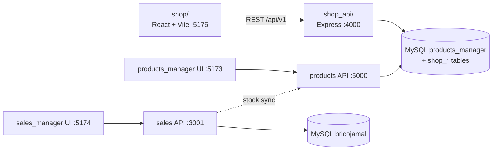
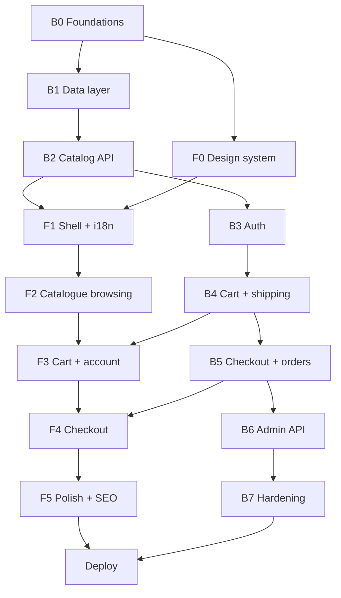

# SohofiBrico E-Commerce — Roadmap

Building a public online store on top of the existing SohofiBrico inventory system.

| | Stack |
| --- | --- |
| **Frontend** | React 18 + Vite + Tailwind CSS — **JSX only, no TypeScript** |
| **Backend** | Node.js + Express + MySQL (`mysql2`) |
| **Currency** | MAD (Moroccan Dirham) |
| **Languages** | French (default) + Arabic (RTL) |

---

## Table of contents

1. [Audit of the existing system](#1-audit-of-the-existing-system)
2. [Target architecture](#2-target-architecture)
3. [Database plan](#3-database-plan)
4. [Backend roadmap](#4-backend-roadmap)
5. [Frontend roadmap](#5-frontend-roadmap)
6. [Cross-cutting concerns](#6-cross-cutting-concerns)
7. [Deployment](#7-deployment)
8. [Phase summary & dependencies](#8-phase-summary--dependencies)
9. [Open decisions](#9-open-decisions)

---

## 1. Audit of the existing system

### What already exists

| Item | Reality in the repo |
| --- | --- |
| Catalogue DB | `products_manager` — **11,327 products**, **8 categories** |
| Sales DB | `bricojamal` — POS sales, customers, credit, wishlists, suppliers |
| Catalogue API | Express `:5000` — `/api/products`, `/api/categories`, `/api/stats`, `/api/integration/*` |
| Sales API | Express `:3001` — sales, customers, wishlist, suppliers, out-of-stock |
| Auth | **None anywhere** |
| Stock truth | `products.remaining_stock` + `stock_movements` (the POS already writes `OUT` rows) |

### `products` table — fields available today

```
id, name, name_ar, name_fr,
description, description_ar, description_fr,
category_id, purchase_price, selling_price,
remaining_stock, min_stock_level, max_stock_level,
unit, barcode, sku, brand, supplier, location,
weight, dimensions, image_url, warranty_months,
is_active, is_featured, tags, created_at, updated_at
```

### Categories (from the dump)

| id | FR | AR | colour |
| --- | --- | --- | --- |
| 1 | Droguerie | مواد كيميائية | `#0f766e` |
| 2 | Sanitaire | صحي | `#3b82f6` |
| 3 | Peinture | دهان | `#ea580c` |
| 4 | Quincaillerie | أدوات معدنية | `#f59e0b` |
| 5 | Outillage | أدوات | `#dc2626` |
| 6 | Électricité | كهرباء | `#eab308` |
| 7 | Visserie et boulonnerie | مسامير وصواميل | — |
| 8 | autres | أخرى | `#0f766e` |

### Data-quality gaps that block a shop

| Gap | Impact | Fix phase |
| --- | --- | --- |
| Only **4,046 / 11,327** products have `image_url`, and those are Odoo paths (`uploads/web/image/product.template/...`) that 404 outside Odoo | No product visuals | B1 |
| No `slug` | No SEO-friendly URLs | B1 |
| No VAT / TTC price | Illegal display price in Morocco | B1 |
| `name_ar` / `name_fr` mostly `NULL` | Arabic store unusable | B1 + content task |
| Only 8 flat categories for 11k SKUs | Unbrowsable | B1 |
| Single image per product | Weak PDP | B1 |
| `tags` empty | No facets | B1 |
| No customer accounts, cart, orders | Core commerce missing | B1 |
| `.env` files committed to git | Credential leak | B7 |

---

## 2. Target architecture

Two new apps living beside the existing ones. The catalogue database stays the **single source of truth** for products and stock.



### Why a dedicated API instead of proxying the existing one

Checkout must decrement stock **and** insert a `stock_movements` row inside a single SQL transaction with `SELECT ... FOR UPDATE` row locking. An HTTP hop between services makes overselling nearly guaranteed under concurrency. Writing to the same tables also means the back-office and POS see web orders instantly, with zero sync job.

### Repository layout

```
sohofibrico_manager/
├── products_manager/        existing back-office (untouched)
├── sales_manager/           existing POS (untouched)
├── databases/               existing dumps
├── shop_api/                NEW — Express + MySQL
└── shop/                    NEW — React + Tailwind (JSX)
```

### Ports

| Service | Port |
| --- | --- |
| products_manager frontend | 5173 |
| products_manager API | 5000 |
| sales_manager frontend | 5174 |
| sales_manager API | 3001 |
| **shop frontend** | **5175** |
| **shop API** | **4000** |

---

## 3. Database plan

All changes are **additive**. Nothing existing is dropped or renamed, so the back-office and POS keep working untouched.

### 3.1 Extend `products`

```sql
ALTER TABLE products
  ADD COLUMN slug                  VARCHAR(280) UNIQUE AFTER name,
  ADD COLUMN is_published          TINYINT(1) DEFAULT 0,
  ADD COLUMN vat_rate              DECIMAL(5,2) DEFAULT 20.00,
  ADD COLUMN price_ttc             DECIMAL(10,2)
       GENERATED ALWAYS AS (selling_price * (1 + vat_rate/100)) STORED,
  ADD COLUMN compare_at_price      DECIMAL(10,2) NULL,   -- crossed-out price
  ADD COLUMN short_description_fr  VARCHAR(300) NULL,
  ADD COLUMN short_description_ar  VARCHAR(300) NULL,
  ADD COLUMN seo_title             VARCHAR(180) NULL,
  ADD COLUMN seo_description       VARCHAR(320) NULL,
  ADD COLUMN subcategory_id        INT NULL,
  ADD COLUMN brand_id              INT NULL,
  ADD COLUMN web_stock_buffer      INT DEFAULT 0,        -- units reserved for walk-ins
  ADD COLUMN views_count           INT DEFAULT 0,
  ADD COLUMN sold_count            INT DEFAULT 0;

CREATE FULLTEXT INDEX ft_products ON products(name, name_fr, name_ar, description);
CREATE INDEX idx_pub_cat_price ON products(is_published, category_id, selling_price);
CREATE INDEX idx_pub_stock     ON products(is_published, remaining_stock);
CREATE INDEX idx_slug          ON products(slug);
```

### 3.2 New tables

| Table | Key columns | Purpose |
| --- | --- | --- |
| `product_images` | `product_id, url, alt_fr, alt_ar, sort_order, is_primary` | Gallery |
| `subcategories` | `category_id, name_fr, name_ar, slug, icon, sort_order` | 2-level tree for 11k SKUs |
| `brands` | `name, slug, logo_url` | Normalised from `products.brand` text |
| `shop_customers` | `email, password_hash, name, phone, is_verified, verify_token, reset_token, customer_id (FK → customers, nullable)` | Storefront accounts, optionally linked to an existing credit customer |
| `customer_addresses` | `customer_id, label, full_name, phone, city, address, postal_code, type(shipping/billing), is_default` | Address book |
| `carts` | `id, customer_id NULL, guest_token, expires_at` | Server-side cart |
| `cart_items` | `cart_id, product_id, quantity, unit_price_snapshot` | Lines |
| `orders` | `order_number, customer_id, status, payment_method, payment_status, subtotal_ht, vat_total, shipping_fee, discount_total, total_ttc, shipping_snapshot JSON, coupon_code, notes` | Header |
| `order_items` | `order_id, product_id, product_name, sku, unit_price_ht, vat_rate, quantity, line_total_ttc` | **Price snapshot** — never join live prices |
| `order_status_history` | `order_id, from_status, to_status, changed_by, note` | Audit trail |
| `shipping_zones` | `name, cities JSON, is_active` | Casablanca / Rabat / national… |
| `shipping_rates` | `zone_id, fee, free_threshold, eta_days, method(delivery/pickup)` | Tariffs |
| `coupons` | `code, type(percent/fixed), value, min_cart, max_uses, used_count, starts_at, ends_at` | Promotions |
| `product_reviews` | `product_id, customer_id, rating, title, body, is_approved` | Social proof |
| `wishlists` | `customer_id, product_id` | Web wishlist (distinct from POS `customer_wishlist`) |
| `newsletter_subscribers` | `email, lang, is_active` | Marketing |

### 3.3 Order status machine

```
pending_payment ──► paid ──► preparing ──► shipped ──► delivered
       │                                       │
       └──────────────► cancelled ◄────────────┘
                              │
                              └──► refunded
```

`cancelled` before `shipped` restocks the items and writes a compensating `stock_movements` row.

### 3.4 Data scripts (one-off, `shop_api/scripts/`)

- [ ] `generate-slugs.js` — slugify `name` + de-duplicate with `-2`, `-3` suffixes
- [ ] `seed-subcategories.js` — derive a tree from name keywords, then manual review
- [ ] `normalize-brands.js` — `products.brand` text → `brands` table + `brand_id`
- [ ] `backfill-images.js` — pull Odoo assets, resize with `sharp` to webp 400/800/1200, fallback to category placeholder
- [ ] `apply-publish-rules.js` — publish only `is_active = 1 AND selling_price > 0 AND remaining_stock >= 0`
- [ ] `seed-shipping.js` — Moroccan cities and default tariffs

---

## 4. Backend roadmap

### Dependencies

```bash
# runtime
express mysql2 dotenv cors helmet express-rate-limit compression
jsonwebtoken bcryptjs cookie-parser zod multer sharp nodemailer
pino pino-http node-cron slugify dayjs

# dev
nodemon supertest vitest
```

### Folder structure

```
shop_api/
├── src/
│   ├── config/           db.js  env.js  mailer.js  constants.js
│   ├── db/
│   │   ├── migrations/   001_products_alter.sql … 010_reviews.sql
│   │   └── migrate.js    tiny runner with a migrations table
│   ├── middlewares/      auth.js  requireRole.js  validate.js
│   │                     errorHandler.js  notFound.js  rateLimiters.js
│   ├── modules/
│   │   ├── catalog/      routes.js controller.js service.js repository.js
│   │   ├── auth/
│   │   ├── cart/
│   │   ├── orders/
│   │   ├── shipping/
│   │   ├── payments/
│   │   ├── reviews/
│   │   └── admin/
│   ├── utils/            apiResponse.js  price.js  pagination.js
│   │                     slug.js  asyncHandler.js
│   ├── app.js
│   └── server.js
├── uploads/              product images (served static)
├── .env.example
└── package.json
```

### Response envelope

```json
{ "success": true,  "data": {}, "meta": { "page": 1, "total": 11327 } }
{ "success": false, "error": { "code": "INSUFFICIENT_STOCK", "message": "…", "details": [] } }
```

---

### Phase B0 — Foundations

- [ ] `bun init` in `shop_api/`, install deps, `nodemon` dev script
- [ ] `.env.example`: `PORT=4000`, `DB_HOST/PORT/USER/PASSWORD/NAME=products_manager`, `JWT_SECRET`, `JWT_REFRESH_SECRET`, `CORS_ORIGINS`, `SMTP_*`, `CMI_*`, `PUBLIC_URL`
- [ ] Pooled MySQL connection (`connectionLimit: 10`, `utf8mb4`, `decimalNumbers: true`)
- [ ] `app.js`: helmet, cors allowlist, compression, cookie-parser, JSON limit, pino-http
- [ ] `GET /api/v1/health` → DB ping + uptime
- [ ] Global error handler + `asyncHandler` wrapper + standard envelope
- [ ] Migration runner (`bun run migrate`)

### Phase B1 — Data layer

- [ ] Write all migrations from [§3](#3-database-plan)
- [ ] Run and verify on a **copy** of the dump first
- [ ] Run the six data scripts
- [ ] Add `views` for the shop: `v_shop_products` (published + primary image + category names)
- [ ] Verify: `SELECT COUNT(*) FROM products WHERE is_published = 1` is a sane number

### Phase B2 — Catalog API (public, read-only)

```
GET  /api/v1/categories                     tree + counts
GET  /api/v1/categories/:slug
GET  /api/v1/brands
GET  /api/v1/products                       ?page&limit&category&subcategory&brand
                                            &min_price&max_price&in_stock&sort&q
GET  /api/v1/products/:slug                 detail + gallery + specs + related
GET  /api/v1/products/:slug/stock           live availability
GET  /api/v1/products/:slug/reviews
GET  /api/v1/search/suggest?q=               autocomplete: name, sku, barcode
GET  /api/v1/filters?category=              facet counts for the sidebar
GET  /api/v1/home                           hero + featured + new + top categories
```

- [ ] `sort`: `relevance | price_asc | price_desc | newest | popular | name`
- [ ] `FULLTEXT MATCH … AGAINST` in boolean mode, `LIKE` fallback for short queries
- [ ] Keyset pagination for deep pages
- [ ] 60-second in-memory cache on `/home`, `/categories`, `/filters`
- [ ] Never expose `purchase_price` — whitelist columns in the repository layer

### Phase B3 — Auth & customers

```
POST /api/v1/auth/register            POST /api/v1/auth/login
POST /api/v1/auth/refresh             POST /api/v1/auth/logout
POST /api/v1/auth/forgot-password     POST /api/v1/auth/reset-password
GET  /api/v1/auth/verify-email/:token
GET  /api/v1/me                       PATCH /api/v1/me
GET|POST|PATCH|DELETE /api/v1/me/addresses/:id?
GET|POST|DELETE       /api/v1/me/wishlist/:productId?
```

- [ ] bcrypt cost 12, access token 15 min, refresh token 30 d in an **httpOnly, sameSite=lax, secure** cookie
- [ ] Rate limit: 5 login attempts / 15 min / IP
- [ ] Optional link to an existing `customers` row → unlocks wholesale pricing later

### Phase B4 — Cart & shipping

```
GET    /api/v1/cart                 POST   /api/v1/cart/items
PATCH  /api/v1/cart/items/:id       DELETE /api/v1/cart/items/:id
POST   /api/v1/cart/merge           POST   /api/v1/cart/coupon
GET    /api/v1/shipping/zones       GET    /api/v1/shipping/quote?city=&subtotal=
```

- [ ] Guest cart via `cart_token` cookie, merged into the account cart on login
- [ ] Every `GET /cart` re-validates live price + stock and returns `unavailable_items[]`
- [ ] Totals always computed server-side: `subtotal_ht`, `vat_total`, `shipping_fee`, `discount`, `total_ttc`
- [ ] Nightly cron purges carts older than 30 days

### Phase B5 — Checkout & orders

```
POST /api/v1/orders                      create
GET  /api/v1/orders                      my orders
GET  /api/v1/orders/:number              detail + timeline
POST /api/v1/orders/:number/cancel       restock if not shipped
GET  /api/v1/orders/:number/invoice      PDF
POST /api/v1/payments/cmi/init
POST /api/v1/payments/cmi/callback       webhook (signature verified)
```

**Order creation — one transaction, in this exact order:**

1. `BEGIN`
2. `SELECT id, remaining_stock, selling_price, vat_rate FROM products WHERE id IN (…) FOR UPDATE`
3. Validate each line against `remaining_stock - web_stock_buffer`; on failure `ROLLBACK` + `409 INSUFFICIENT_STOCK` with the offending items
4. Recompute all totals server-side (ignore anything the client sent)
5. `INSERT INTO orders` + `INSERT INTO order_items` (snapshotted names and prices)
6. `UPDATE products SET remaining_stock = remaining_stock - ?, sold_count = sold_count + ?`
7. `INSERT INTO stock_movements (product_id, movement_type='OUT', reference_type='online_order', reference_number=order_number, created_by='shop')` → **visible instantly in the back-office and POS**
8. `COMMIT`
9. Clear the cart, send the confirmation email (FR/AR), notify the store

**Payment methods (Morocco):**

| Method | Priority | Notes |
| --- | --- | --- |
| Cash on delivery (*paiement à la livraison*) | Launch | Default and dominant locally |
| CMI hosted card page | Phase 2 | Requires a merchant contract |
| Bank transfer | Launch | Manual confirmation in admin |
| Pay in store / pickup | Launch | No shipping fee |

- [ ] Cron every 5 min: release stock from `pending_payment` card orders older than 30 min

### Phase B6 — Admin API

Protected by JWT + `requireRole('admin','staff')`, reusing the existing `users` table (`admin | staff | viewer`).

```
GET   /api/v1/admin/orders              filters: status, date, city, method
PATCH /api/v1/admin/orders/:id/status
GET   /api/v1/admin/dashboard           web revenue vs POS, AOV, top products, conversion
PATCH /api/v1/admin/products/:id/publish
POST  /api/v1/admin/products/:id/images        (multer + sharp)
DELETE/api/v1/admin/products/:id/images/:imgId
CRUD  /api/v1/admin/coupons  /shipping-rates  /reviews (moderation)
```

### Phase B7 — Hardening & tests

- [ ] `zod` schema on every body / query / param
- [ ] Prepared statements only — zero string concatenation in SQL
- [ ] Strict CORS allowlist, `helmet` CSP, rate limits per route group
- [ ] Upload guard: mime + magic-byte + size checks, randomised filenames
- [ ] **Rotate the credentials currently committed in `.env` files, add them to `.gitignore`**
- [ ] `supertest` suites: auth flow, cart validation, **concurrent checkout race on the same SKU**, coupon edge cases
- [ ] Structured logs + a `/metrics` or uptime endpoint

---

## 5. Frontend roadmap

### Dependencies

```bash
react react-dom react-router-dom
@tanstack/react-query axios zustand
react-hook-form zod @hookform/resolvers
i18next react-i18next i18next-browser-languagedetector
tailwindcss postcss autoprefixer
framer-motion lucide-react embla-carousel-react
react-helmet-async react-hot-toast

# dev
vite @vitejs/plugin-react vitest @testing-library/react @biomejs/biome
```

> No TypeScript. `jsconfig.json` with a `@/*` path alias gives editor autocomplete without TS.

### Folder structure

```
shop/
├── src/
│   ├── api/          client.js  catalog.js  cart.js  auth.js  orders.js
│   ├── components/
│   │   ├── ui/       Button Input Select Modal Drawer Badge Skeleton
│   │   │             Rating Tabs Accordion Breadcrumb Pagination Toast
│   │   ├── layout/   Header MegaMenu MobileNav SearchBar LangSwitch
│   │   │             CartDrawer Footer TrustBar AnnouncementBar
│   │   ├── product/  ProductCard ProductGrid Gallery PriceTag StockBadge
│   │   │             QtyStepper AddToCart SpecTable RelatedProducts
│   │   ├── filters/  FilterSidebar PriceRange CategoryTree BrandFilter
│   │   │             ActiveFilters SortSelect
│   │   └── checkout/ CheckoutSteps AddressForm ShippingPicker
│   │                 PaymentPicker OrderSummary CouponField
│   ├── pages/        Home Category ProductList ProductDetail Search
│   │                 Cart Checkout OrderSuccess NotFound
│   │                 account/{Dashboard Orders OrderDetail Addresses
│   │                          Wishlist Profile}
│   │                 auth/{Login Register Forgot Reset}
│   │                 static/{About Contact Delivery Terms Privacy}
│   ├── store/        cartStore.js  authStore.js  uiStore.js
│   ├── hooks/        useProducts useProduct useCart useDebounce
│   │                 useMediaQuery useRtl useUrlFilters
│   ├── i18n/         index.js  fr.json  ar.json
│   ├── lib/          formatMAD.js  seo.js  cn.js  validators.js
│   ├── App.jsx  main.jsx  index.css
├── jsconfig.json
├── tailwind.config.js
└── vite.config.js      server: { host: '0.0.0.0', port: 5175, proxy: { '/api': 'http://localhost:4000' } }
```

---

### Phase F0 — Design system first

Nothing else gets built before this exists.

- [ ] Tailwind theme tokens — the palette comes from the DB category colours: teal `#0f766e`, orange `#ea580c`, amber `#f59e0b`, red `#dc2626`, yellow `#eab308`
- [ ] Typography: a strong display face for FR headings + a clean body face, **Cairo or Tajawal for Arabic**, loaded conditionally per language
- [ ] Spacing / radius / shadow scale, container widths, z-index ladder
- [ ] `components/ui/*` primitives, each with loading + disabled + error states
- [ ] Skeleton loaders from day one — 11k products means real latency
- [ ] RTL utilities: logical properties (`ps-`/`pe-`), `dir` on `<html>`, mirrored icons
- [ ] Decide the rendering strategy for SEO (see [§6](#6-cross-cutting-concerns))

### Phase F1 — Shell, routing, i18n

- [ ] Router with lazy-loaded routes + a shared layout
- [ ] Header: logo, mega-menu (8 categories → subcategories), sticky search, account, cart badge, language switch
- [ ] Mobile: bottom nav bar + full-screen menu drawer
- [ ] Footer: categories, info pages, contact, payment/delivery icons
- [ ] `i18next` with `fr.json` / `ar.json`, language persisted, `dir="rtl"` toggled
- [ ] `formatMAD()` helper — `1 250,00 DH` in FR, `١٢٥٠٫٠٠ د.م.` handling in AR
- [ ] React Query provider (`staleTime: 60s`, retry 1), axios interceptors for 401 → refresh
- [ ] Error boundary + 404 page

### Phase F2 — Catalogue browsing

**Home**
- [ ] Hero with seasonal promo
- [ ] Category grid using the DB icon + colour per category
- [ ] Featured rail (`is_featured = 1`), new arrivals, best sellers (`sold_count`)
- [ ] Trust bar: livraison rapide, paiement à la livraison, garantie, conseil en magasin
- [ ] Brand strip, newsletter block

**Product list (PLP)**
- [ ] Filter sidebar: category tree, price range slider (MAD), brand, in-stock only, unit
- [ ] Filters synced to the URL (`?category=outillage&min=50&sort=price_asc`) so pages are shareable
- [ ] Sort select, grid/list toggle, results count, active-filter chips
- [ ] Pagination **or** infinite scroll, skeleton grid, empty state with suggestions
- [ ] Mobile: filters in a bottom sheet

**Product detail (PDP)**
- [ ] Gallery with thumbnails + zoom + swipe, placeholder when no image
- [ ] Title (localised with `name_{lang} → name` fallback), brand, SKU, rating
- [ ] Price TTC, crossed-out `compare_at_price`, "TVA incluse" note
- [ ] Stock badge driven by `remaining_stock` vs `min_stock_level`: *En stock* / *Stock limité* / *Sur commande*
- [ ] Qty stepper + add-to-cart with optimistic feedback
- [ ] Spec table: SKU, barcode, brand, unit, weight, dimensions, warranty, location
- [ ] Tabs: description, specifications, delivery & returns, reviews
- [ ] Related products from the same category, recently viewed
- [ ] Breadcrumb + JSON-LD `Product` schema

**Search**
- [ ] Debounced autocomplete dropdown — matches name, **SKU and barcode** (your staff and customers already search this way)
- [ ] Results page reusing the PLP grid, "did you mean", recent searches

### Phase F3 — Cart & account

- [ ] Cart drawer (slide-over) + full cart page
- [ ] Qty edit, remove, line totals, coupon field, shipping estimator by city
- [ ] Free-shipping progress bar, unavailable-item warnings, empty-cart state
- [ ] Zustand cart store persisted to `localStorage`, synced with the server cart
- [ ] Auth pages: login, register, forgot, reset — inline validation in both languages
- [ ] Account: dashboard, order history, order detail with status timeline, address book, wishlist, profile & password

### Phase F4 — Checkout

- [ ] Three steps — **Adresse → Livraison → Paiement** — with a sticky order summary
- [ ] Guest checkout with an optional "create an account" checkbox
- [ ] Address form: city select driving the shipping quote, phone validation (Moroccan format)
- [ ] Delivery options: home delivery per zone, or free in-store pickup
- [ ] Payment: COD (default), card via CMI redirect, bank transfer
- [ ] Review step listing every line, fees and the grand total TTC
- [ ] Success page: order number, summary, WhatsApp contact, "track my order"
- [ ] Double-submit guard, loading states, clear server-error mapping (e.g. `INSUFFICIENT_STOCK` → highlight the offending line)

### Phase F5 — Polish & performance

- [ ] Framer-motion: page transitions, staggered grid reveals, drawer springs — subtle, never blocking
- [ ] Images: `loading="lazy"`, `srcset` on the 400/800/1200 webp variants, blur-up placeholder, fixed aspect ratios to kill layout shift
- [ ] Route prefetch on link hover, React Query prefetch for PDP from the card
- [ ] Virtualised list for very long result sets
- [ ] SEO: `react-helmet-async` meta per page, canonical URLs, Open Graph, JSON-LD `Product` + `BreadcrumbList` + `Organization`, generated `sitemap.xml` from slugs, `robots.txt`
- [ ] Accessibility: focus traps in modals, keyboard nav, ARIA labels in both languages, contrast audit
- [ ] Mobile QA on real devices — this audience is mobile-first
- [ ] Lighthouse target: Performance ≥ 90, Accessibility ≥ 95
- [ ] `vitest` + Testing Library on cart logic, filters, price formatting

---

## 6. Cross-cutting concerns

### Internationalisation

- French is the default; Arabic is a full RTL mirror, not an afterthought.
- Fallback chain for every localised field: `name_ar → name_fr → name`.
- `name_ar` / `name_fr` are largely `NULL` → plan a content task to translate the **top 500 sellers** first, and add a translation field to the back-office product form.
- Category names already exist in FR and AR — use them.

### Pricing & VAT

- Keep `selling_price` as-is (HT) and display TTC with a 20 % `vat_rate` per product.
- Totals are **always** computed server-side. The client never sends a price.
- Wholesale tier (existing `customers.customer_type = wholesale`) is a later phase, unlocked by linking `shop_customers.customer_id`.

### Stock integrity

- Online stock = `remaining_stock - web_stock_buffer`, so walk-in customers are never disappointed.
- Web orders write `stock_movements` with `reference_type = 'online_order'` → the POS reports stay accurate.
- Low-stock products can be shown as *Sur commande* instead of being hidden.

### Images (the biggest content risk)

1. Try to bulk-export from the Odoo instance the current URLs point to.
2. Whatever is recovered gets resized by `sharp` into 400 / 800 / 1200 webp.
3. Everything else falls back to a branded per-category placeholder.
4. Add drag-and-drop image upload to the back-office so staff fill the gaps over time.
5. Consider publishing only products that have an image at launch.

### Analytics & marketing

- GA4 or Plausible, plus a `product_views` counter feeding the *popular* sort.
- WhatsApp Business floating button — the highest-converting contact channel locally.
- Newsletter capture, abandoned-cart email after 24 h (Phase 2).

---

## 7. Deployment

| Layer | Setup |
| --- | --- |
| Server | VPS (Ubuntu) with Nginx as reverse proxy |
| Frontend | `vite build` → static files served by Nginx |
| API | `shop_api` on `:4000` under PM2 (cluster mode), Nginx `/api` → `:4000` |
| DB | Existing MySQL, nightly `mysqldump` to off-server storage |
| TLS | Let's Encrypt with auto-renew |
| Env | `.env` on the server only, never in git |
| Monitoring | PM2 logs + uptime ping on `/api/v1/health` |

Staging first: a clone of the DB with the migrations applied, so nothing is tested against live stock.

---

## 8. Phase summary & dependencies



| Phase | Deliverable | Blocks |
| --- | --- | --- |
| B0 | API skeleton, health, error handling | everything backend |
| B1 | Migrations + enriched catalogue | B2 |
| B2 | Public catalogue endpoints | F1, F2, B3 |
| F0 | Design system + tokens | all UI |
| F1 | Shell, routing, i18n, RTL | F2 |
| F2 | Home, PLP, PDP, search | F3 |
| B3 | Auth + customer profile | B4 |
| B4 | Cart + shipping quotes | B5, F3 |
| F3 | Cart UI + account area | F4 |
| B5 | Transactional checkout | F4, B6 |
| F4 | Checkout UI | F5 |
| B6 | Admin orders console | B7 |
| F5 / B7 | SEO, perf, security, tests | Deploy |

### Minimum viable launch

B0 → B1 → B2 → F0 → F1 → F2 → B3 → B4 → F3 → B5 → F4, with **COD only**, a curated product subset, and a basic admin order list. Everything else ships after.

---

## 9. Open decisions

These change the plan, so they are needed before Phase 0 starts.

1. **Images** — is the Odoo instance behind the current `image_url` paths reachable for a bulk export, or do we launch with category placeholders and fill in manually?
2. **Payments** — COD only at launch, or CMI card payments from day one (requires a merchant contract)?
3. **Catalogue scope** — publish all 11,327 SKUs, or a curated subset (has an image, stock > 0, real selling price)?
4. **Prices** — is `selling_price` HT or already TTC in the current data?
5. **Database** — shared `products_manager` DB (recommended) or a separate `sohofibrico_shop` DB with a sync job?
6. **SEO** — does the shop need Google ranking? If yes, the storefront needs prerendering or SSR, which is decided in F0, not retrofitted later.
7. **Admin UI** — a new `/admin` area inside the shop app, or new screens added to the existing `products_manager`?

---

*Document version 1 — generated from an audit of `products_manager` and `sales_manager` at commit `d2f0166`.*
